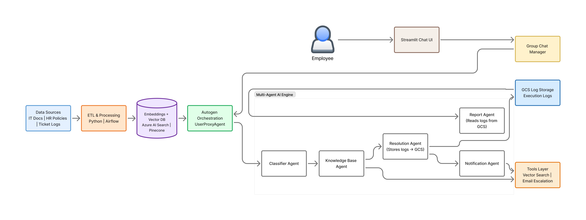

# MULTI-AGENT IT TICKET RESOLVER  
AI-Powered IT, HR & Policy Support System with Multi-Agent Reasoning


---

## 🔍 Overview

**MULTI-AGENT IT RESOLVER TICKET** is a cloud-native, end-to-end **AI support automation platform** that intelligently resolves **IT, HR, and labor-policy (PL)** queries using a **multi-agent architecture** powered by AutoGen.

The system classifies incoming tickets, retrieves relevant knowledge using **vector search (Azure Cognitive Search)**, generates grounded responses through a **Resolver Agent**, and automatically escalates unresolved issues - while logging all activity for analytics and reporting.

The platform is fully containerized, and deployed on **Google Cloud Run**, with **Streamlit** frontends for both support interaction and reporting.

---

## 🌐 Live Deployments

| Component | Platform | URL |
|---------|--------|-----|
| **TriAxis Support – Chat UI** | Cloud Run | https://triaxis-support-568640367142.us-central1.run.app/ |
| **Ticket Analytics & Report App** | Cloud Run | https://report-app-568640367142.us-central1.run.app/ |

---

## ⚙️ Key Capabilities

- 🤖 **Multi-Agent Orchestration (AutoGen)**
- 🧠 **RAG-powered Knowledge Retrieval (Azure Cognitive Search)**
- 📊 **Automated Ticket Analytics & Markdown Reporting**
- 🚨 **Auto-Escalation with Email Notifications**
- ☁️ **Production-grade Cloud Deployment (Docker + Cloud Run)**

---

## 🧠 System Architecture

### 🧱 Architecture Diagram



---

## 🚀 Technologies Used

Python · AutoGen · Streamlit · Azure OpenAI · Azure Cognitive Search ·  
Google Cloud Run · Google Cloud Storage · Docker · Cloud Build

---
## 📚 Data Sources & Knowledge Base

The system’s knowledge base is built from a combination of **authoritative public documentation**, **open datasets**, and **synthetic data** to ensure broad coverage across IT, HR, and policy-related support scenarios.

---

### 🔧 IT Troubleshooting Sources

**Microsoft Troubleshooting & Technical Documentation**
- Official Microsoft product documentation and troubleshooting guides  
- Covers common issues related to:
  - Azure services  
  - Authentication & access  
  - Networking, APIs, storage, and application errors  
- Used as the primary source for IT support and technical resolution workflows

---

### 👥 HR & Policy Sources

**U.S. Department of Labor (DOL) Fact Sheets**
- Authoritative labor-law and policy guidance  
- Topics include:
  - Overtime and wage & hour rules  
  - Employment classification  
  - Leave and benefits  
  - Recordkeeping and worker protections  
- Used to power HR and policy (PL) ticket responses with compliance-safe grounding

**syncora/hr-policies-qa-dataset**
- Open HR policy Q&A dataset  
- Provides realistic HR policy questions and responses  
- Used to enhance HR classification accuracy and response consistency

---

### 🧪 Synthetic Data

**Synthetic IT and HR Support Scenarios**
- Generated to supplement real-world datasets  
- Used for:
  - Training and testing the classifier agent  
  - Expanding edge cases and rare scenarios  
  - Validating multi-agent orchestration and escalation logic  
- No sensitive or personally identifiable information (PII) is included

---
## 🗂 Repository Structure

```
MULTI_AGENT_IT_RESOLVER_TICKET/
├── app.py                 # Main Streamlit support UI
├── report_app.py          # Analytics & reporting UI
├── group_chat2.py         # AutoGen multi-agent orchestration
│
├── agents/                # All AutoGen agents
│   ├── classifier_agent.py
│   ├── knowledge_base_agent.py
│   ├── resolver_agent.py
│   ├── notification_agent.py
│   └── report_agent.py
│
├── tools/                 # External system integrations
│   ├── knowledge_base_tool.py
│   ├── report_tools.py
│   └── send_email.py
│
├── utils/                 # Shared utilities & prompts
│   ├── llm_config.py
│   ├── prompt.py
│   ├── chat_logger.py
│   ├── log_loader.py
│   └── stdout_capture.py
│
├── Dockerfile
├── Dockerfile.report
├── cloudbuild.yaml
├── requirements.txt
├── style.css
└── README.md
```

---

## ⚙️ Environment Setup

```bash
git clone https://github.com/Big-Data-Team3/MULTI_AGENT_IT_RESOLVER_TICKET.git
cd MULTI_AGENT_IT_RESOLVER_TICKET
pip install -r requirements.txt
```

Create `.env` (not committed):

```env
AZURE_OPENAI_API_KEY=xxxxxxxx
AZURE_OPENAI_ENDPOINT=https://<endpoint>.openai.azure.com/
AZURE_DEPLOYMENT_NAME=gpt-4.1
AZURE_API_VERSION=2025-01-01-preview

AZURE_SEARCH_ENDPOINT=https://<search>.search.windows.net
AZURE_SEARCH_KEY=xxxxxxxx

GOOGLE_CLOUD_PROJECT=<project-id>
LOG_BUCKET_NAME=<gcs-bucket>

LLAMA_CLOUD_API_KEY=<llama-api-key>
DEBUG_EXTRACTION=1
OPENAI_API_KEY=<open-ai-key>
OPENAI_MODEL=<model-name>
```

---

## 👥 Team Contributions

- **Krittivasan Jagannathan** - Multi-agent orchestration, Streamlit apps, Cloud Run deployment
- **Sthavir Gokul Soroff** - Azure Search pipelines, Airflow DAGs, KB ingestion
- **Pooja Subramanya Raghu** - IT & HR knowledge extraction, DOL policy pipelines

---

## 🎥 Demo Video

📺 **YouTube Demo Placeholder**  

https://youtu.be/QECQXVFFGuM

---

## 📘 Documentation

📄 **Google Docs**  

https://codelabs-preview.appspot.com/?file_id=1eBSyazOjvroYT7ssjjQkxzGdYaeAGfSuqOXTACvYKAA#0


---

## 🧾 Attestation

We attest that this project is our original work and complies with Northeastern University academic policies.

**Institution:** Northeastern University – Information Systems Program  
**Date:** December 2025

---

## 🧠 Key Takeaway

This project demonstrates how **multi-agent AI systems**, combined with **RAG** and **cloud-native deployment**, can automate enterprise IT and HR support at scale.
